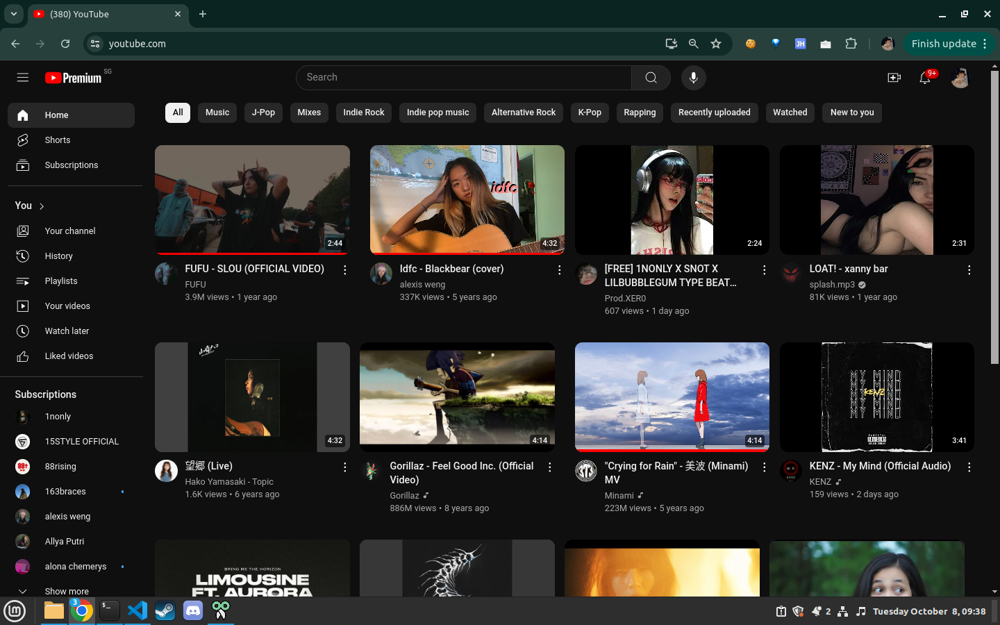

<!-- created by r3xdev -->

  

<h1 align="center">Fake YouTube Premium</h1>

  A lightweight Chrome extension that swaps the YouTube logo to the Premium version — no subscription needed.

  
  
  

  
  

---

  

---

## Installation

1. Clone or download this repository as a ZIP
2. If downloaded as ZIP, extract it
3. Open **Chrome**, **Brave**, or any Chromium-based browser
4. Go to `chrome://extensions/`
5. Enable **Developer mode** (top right toggle)
6. Click **Load unpacked**
7. Select the folder where you cloned/extracted this repo
8. Open [youtube.com](https://youtube.com) — the logo should now look Premium

---

## Changelog

See [CHANGELOG.md](./CHANGELOG.md) for full version history.

---

Copyright &copy; <a href="https://github.com/r3xdev">r3xdev</a>
